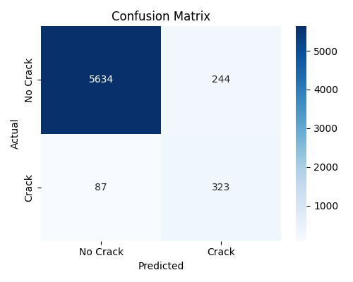

# Steel-Crack-Detection-using-ViT
🧠 Steel Crack Detection using Vision Transformers (ViT)

  

📖 Introduction

Steel surfaces in industries like shipbuilding, automotive, and infrastructure often develop cracks from fatigue, stress, or corrosion.
This project leverages Vision Transformers (ViT) for automated crack detection, achieving higher precision, recall, and generalization compared to CNN-based methods.

🎯 Problem Statement

Manual inspection is time-consuming & error-prone

Traditional methods fail for fine cracks or variable lighting

Aim: build a robust ViT model to classify steel patches into Crack / No Crack

📂 Dataset

Patch Size: 512×512 px

Training Samples: ~20,000

Testing Samples: ~6,000

Class Distribution:

Crack: ~3,540

No Crack: ~51,397 (imbalanced)

⚙️ Methodology

Preprocessing: Resize (384×384), normalization

Augmentation: Flips, rotations, color jitter, affine & perspective transforms

Imbalance Handling: WeightedRandomSampler + Focal Loss (α=0.5, γ=1.5)

Model: ViT-B/16 (ImageNet-1K pretrained) + binary classifier head

Optimizer: Adam (lr=1e-4) + ReduceLROnPlateau scheduler

🏋️ Training Setup

Epochs: 15

Batch Size: 32

Device: CUDA GPU

Metrics: Precision, Recall, F1-score, Accuracy, Confusion Matrix

📊 Results

Classification Report

No Crack → Precision: 0.99 | Recall: 0.98 | F1: 0.985
Crack    → Precision: 0.92 | Recall: 0.94 | F1: 0.93

✅ Crack recall: 94%
✅ False negatives reduced vs CNN baseline

  

💡 Key Insights

ViT achieves higher recall → fewer missed cracks

Stronger generalization vs CNNs

Trade-off: longer training & higher GPU usage

🚀 Future Scope

Real-time crack detection in video streams

Integration with robotic arms / UAVs

Multi-defect detection (beyond cracks)

Hybrid CNN–ViT for faster inference

🛠️ Tech Stack

Python, PyTorch, TorchVision, timm

Vision Transformer (ViT-B/16)

scikit-learn, matplotlib, seaborn

CUDA for training acceleration

🏆 Resume Highlight

“Developed a ViT-based crack detection pipeline with focal loss, balanced sampling, and augmentation — achieving 94% recall on cracks while reducing false negatives compared to CNNs.”
